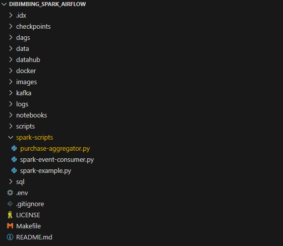
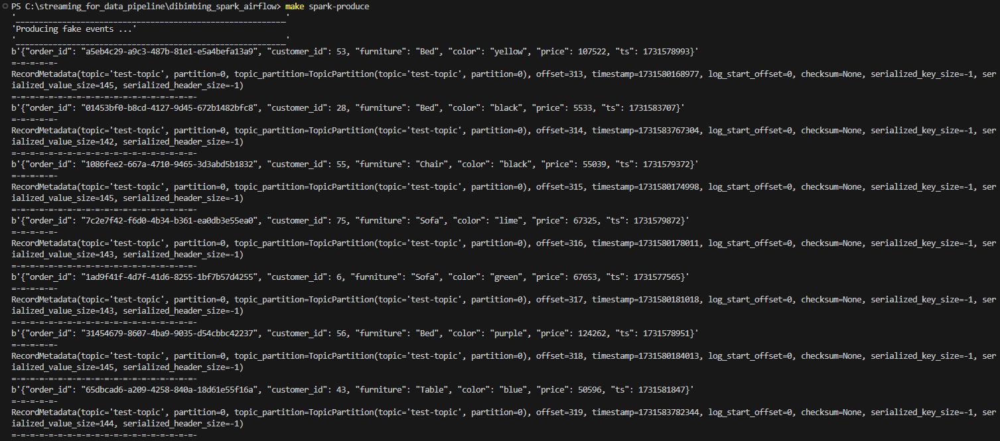
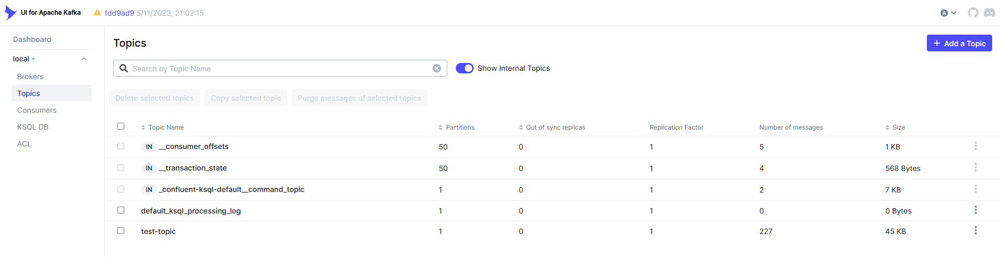
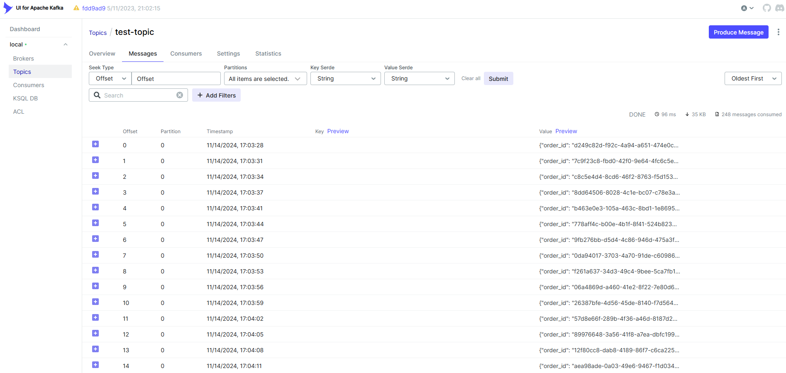
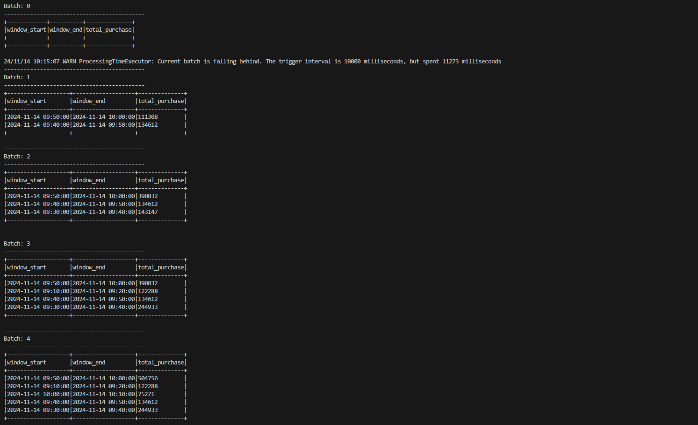

# Streaming Data Pipeline: Real-time Purchase Analytics
A real-time streaming data pipeline that processes purchase events using Apache Kafka and Apache Spark Streaming.

## Overview
This project implements a real-time data pipeline that:
- Generates simulated purchase events (furniture store transactions)
- Streams the events through Apache Kafka
- Processes the stream using Apache Spark Structured Streaming
- Aggregates purchase amounts in 10-minute windows
- Displays real-time analytics on the console



## Prerequisites
- Docker and Docker Compose
- Python 3.8+
- Make (for running commands)
- Git (for cloning repository)

## Technologies Used
- Apache Kafka 3.3
- Apache Spark 3.3.4
- Python 3.8+
- Kafka UI
- Docker & Docker Compose

## Installation & Setup

1. Clone the repository:
```bash
git clone https://github.com/abilfarabil/streaming-purchase-analytics.git
cd streaming-data-pipeline
```

2. Create Docker network:
```bash
docker network create dataeng-network
```

3. Start Kafka:
```bash
make kafka
```

4. Wait for 30 seconds, then start Spark:
```bash
make spark
```

## Project Structure
```
.
├── docker/
│   ├── docker-compose-kafka.yml
│   ├── docker-compose-spark.yml
│   └── Dockerfile.spark
├── spark-scripts/
│   ├── purchase-aggregator.py
│   └── spark-example.py
├── scripts/
│   └── event_producer.py
└── README.md
```

## Features

### 1. Event Producer
- Generates simulated purchase events with realistic data
- Sends events to Kafka topic continuously
- Each event contains: order_id, customer_id, furniture type, color, price, timestamp



### 2. Kafka Integration
- Uses Apache Kafka as message broker
- Implements producer-consumer pattern
- Provides message persistence and scalability
- Includes Kafka UI for monitoring




### 3. Spark Streaming Processing
- Implements real-time stream processing using Spark Structured Streaming
- Performs windowed aggregations (10-minute windows)
- Calculates total purchase amounts in real-time
- Outputs results to console for monitoring



## Usage

1. Start the producer:
```bash
make spark-produce
```

2. In a new terminal, start the consumer:
```bash
make spark-consume-purchase
```

3. Monitor messages in Kafka UI:
- Open http://localhost:8083 in your browser
- Navigate to Topics → test-topic

4. To stop all services:
```bash
make clean
```

## Code Structure

### Event Producer
```python
class DataGenerator:
    """Generates simulated purchase events"""
    @staticmethod
    def get_data():
        # Generates random purchase data
        return [
            uuid.uuid4().__str__(),  # order_id
            faker.random_int(min=1, max=100),  # customer_id
            faker.random_element(elements=("Chair", "Table", "Desk", "Sofa", "Bed")),  # furniture
            faker.safe_color_name(),  # color
            faker.random_int(min=100, max=150000),  # price
            faker.unix_time(...),  # timestamp
        ]
```

### Stream Processor
```python
def create_spark_session():
    """Initialize Spark session with minimal configurations."""
    return (
        pyspark.sql.SparkSession.builder
        .appName("PurchaseAggregator")
        .master("local[*]")
        .config("spark.sql.shuffle.partitions", 1)
        .getOrCreate()
    )
```

## Monitoring & Management

### Kafka UI
- URL: http://localhost:8083
- Features:
  - Topic management
  - Message browsing
  - Consumer group monitoring
  - Broker configuration

### Console Output
The consumer provides real-time analytics through console output:
```
-------------------------------------------
Batch: 0
-------------------------------------------
+-------------------+-------------------+--------------+
|       window_start|         window_end|total_purchase|
+-------------------+-------------------+--------------+
|2024-11-14 07:00:00|2024-11-14 07:10:00|        25816|
```

## References
- [Apache Kafka Documentation](https://kafka.apache.org/documentation/)
- [Apache Spark Structured Streaming Programming Guide](https://spark.apache.org/docs/latest/structured-streaming-programming-guide.html)
- [Python Faker Documentation](https://faker.readthedocs.io/)

## Contributing
Feel free to open issues or submit pull requests for any improvements.
